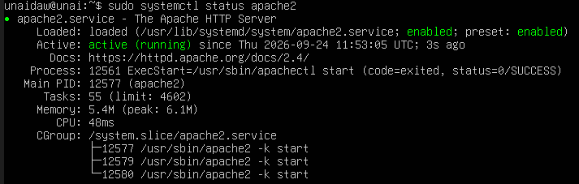
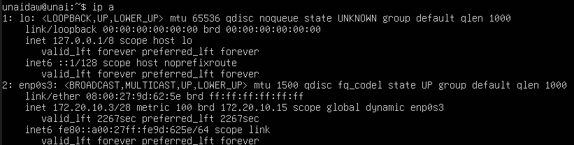

# Práctica 1.2: Instalación de Apache en Ubuntu Server

## Objetivo
Instalar y configurar un servidor web Apache en Ubuntu Server para comprobar que se puede servir contenido HTML desde el navegador del host.

## 1. Instalación de Apache
Para instalar Apache, ejecutamos el siguiente comando en la máquina Ubuntu Server:

```bash
sudo apt update
sudo apt install apache2 -y
```


La instalación crea el servicio web y deja preparado el servidor para responder peticiones HTTP.

## 2. Comprobación del servicio Apache
Tras la instalación, debemos verificar que el servicio está activo y funcionando correctamente:

```bash
sudo systemctl status apache2
```

También es recomendable habilitarlo y arrancarlo si no lo estuviera:

```bash
sudo systemctl enable --now apache2
```



Si el estado aparece como `active (running)`, significa que Apache está funcionando correctamente.

## 3. Consulta de la IP del servidor
Para saber la dirección IP del servidor y poder acceder desde el host, ejecutamos:

```bash
ip a
```

o también:

```bash
hostname -I
```



La IP que normalmente utilizaremos es la del adaptador de red del servidor, por ejemplo `192.168.x.x`. O en mi caso la 172.20.10.3

## 4. Acceso desde el navegador
Desde el equipo cliente o host, abrimos el navegador y accedemos a la dirección del servidor:

```text
http://<IP_del_servidor>
```

Por ejemplo:

```text
http://172.20.10.3
```


Si la instalación ha sido correcta, el navegador mostrará la página de inicio por defecto de Apache, como vemos en la imagen, que confirma que el servidor está respondiendo correctamente.

## 5. Explicación del funcionamiento
Apache es un servidor web que escucha peticiones HTTP y sirve archivos web, normalmente contenidos HTML, CSS, imágenes y otros recursos.

- El navegador realiza una solicitud a la IP del servidor.
- Apache recibe esa petición.
- El servidor busca el contenido solicitado.
- Responde al cliente con el archivo correspondiente.

### Puerto 80 y servicio web
Apache, por defecto, utiliza el puerto 80 para comunicaciones HTTP. Esto significa que las peticiones web se envían a ese puerto y el servidor las atiende.

- HTTP usa el puerto 80.
- HTTPS usa el puerto 443.

En la práctica, al acceder a `http://IP`, el navegador entra en contacto con Apache mediante HTTP y recibe la página web del servidor.

## 6. Concepto de servidor web y HTTP
Un servidor web es un programa que se encarga de atender peticiones de clientes a través de una red. En este caso, Apache es el servidor encargado de ofrecer contenido web.

HTTP (Hypertext Transfer Protocol) es el protocolo de comunicación que permite que el navegador y el servidor se intercambien información. Cuando escribimos una dirección web, el navegador utiliza HTTP para pedir la página y el servidor responde con el contenido.

## 7. Resultado final
La práctica ha sido exitosa si:

- Apache está instalado correctamente.
- El servicio `apache2` está activo.
- La IP del servidor se puede consultar.
- Desde el navegador se accede a la página por defecto de Apache.
- El servicio responde en el puerto 80.


